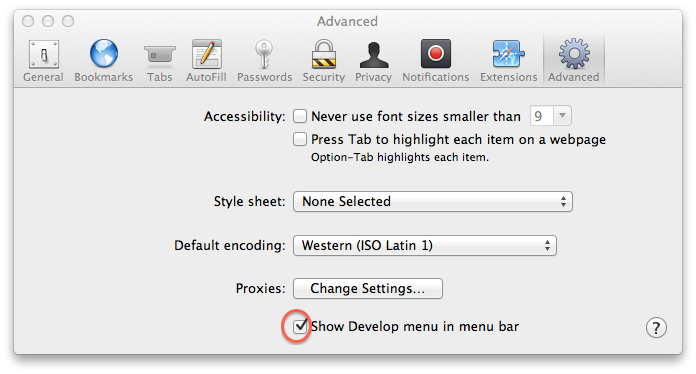
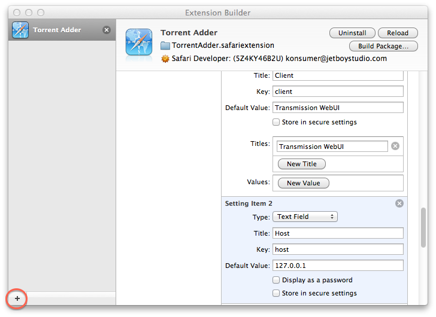
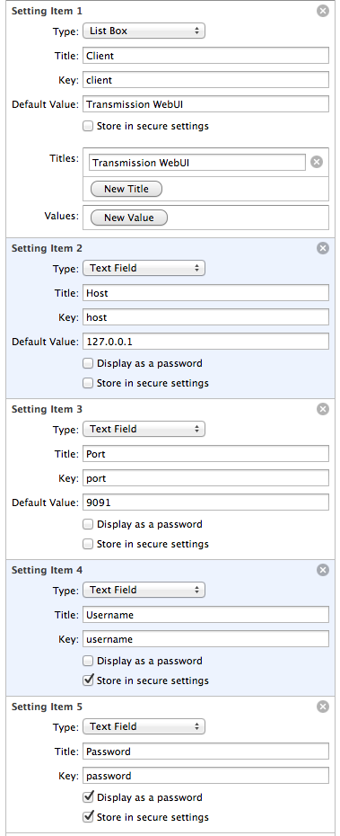

[Earlier](/articles/nas/) I talked about my awesome media/storage server named "stooge".  I want stooge to handle all the torrents on my network. I saw some good extensions for Firefox & Chrome, but not Safari. Since my new housemate prefers Mac Safari, I set out to make it awesome.

---

I just need one for Transmission WebUI, but the principle is the same for any other web-based torrent-thing.  Basically, I want to trigger a callback for the configured back-end (only transmission implemented) and send it a torrent when the user clicks on a torrent file or magnet link.

If you just want to download and use it, click [here](TorrentAdder.safariextz).  If you are curious how I made it, continue reading. This is a simple example to get get you started making Safari extensions.

You can checkout my github project, [here](https://github.com/konsumer/torrentadder).

## Step 1: RTFM

I needed to figure out the Safari API.  [Go read it](http://developer.apple.com/library/safari/#documentation/Tools/Conceptual/SafariExtensionGuide/Introduction/Introduction.html)!  It's a piece of cake.

## Enable your tools

First, you will need a developer certificate. Do that [here](https://developer.apple.com/support/mac/developer-certificates.html)

If you have not done any development on Safari, you may need to enable some stuff.  Here is what I did:

Go to Safari/Preferences/Advanced, and enable the developer menu.

Under new "Develop" menu in toolbar, go to "Show Extension Builder" and add a new extension.

## Global Page

Safari extensions load most of their stuff in the global page file.  I added a file to the extension dir called `global.html`. Mine looked like this:

	<!DOCTYPE html>
	<html>
	   <head>
	      
	   </head>
	   <body></body>
	</html>

Basically, I add some utilities (cross-site AJAX, console.log()) settings handler (both onload, and onchange) and callbacks keyed by the client-name in preferences. Safari annoyingly requires you to pass messages around for different security contexts.  This means that `global.html` can't reach into DOM or console.log(), and injected scripts (more on that in a sec) can't do cross-site AJAX, or directly access preferences. I made my global context able to console.log(), and respond to the message `addTorrent`.  This means that injected start & end scripts can fire this, and it will be run in global context, and global can trigger `log` message, and I can handle that in an injected script.

Transmission requires `X-Transmission-Session-Id` header token to prevent XSS, so I do some K-leet trickery with recursive calling, if it's not set.

## Injected Scripts

I made a file called `end.js` and set it in Extension Builder, under "End Scripts". This file will replace all links with torrent functions, handle global `console.log()`s

`end.js`:

	// text for notification
	var icon = "";
	var title = "Torrent";

	// click handler
	var torrentClick = function(evt){
	    evt.preventDefault();
	    var href = this.href;

	    var message = "Torrent added:" + href.split('/').pop();

	    if (window.webkitNotifications.checkPermission() == 0) {
	        window.webkitNotifications.createNotification(icon, title, message).show();
	    }else{
	        window.webkitNotifications.requestPermission(function(){
	            window.webkitNotifications.createNotification(icon, title, message).show();
	        });
	    }
	    safari.self.tab.dispatchMessage("addTorrent", href);
	};

	// add handler to all torrent links
	var links = document.querySelectorAll("a");
	for (i in links){
	    if (links[i] && links[i].getAttribute){
	        var href = (links[i].getAttribute('href')+"").split('?').shift();
	        if (href && (href.substring(0,7) === "magnet:" || href.substr(-8) === ".torrent")){
	            links[i].removeEventListener("click", torrentClick, false);
	            links[i].addEventListener("click", torrentClick, false);
	        }
	    }
	}

	// handle events from global
	safari.self.addEventListener("message", function(msg){
	    switch(msg.name){
	        case "log": // handle global console logs
	            return console.log("global:", msg.message);
	        
	        default: // unhandled
	            return console.log("tab: " + msg.name, msg);
	    }
	}, false);

You can see my handler for global page console.log()'s, at the end. Basically, the rest of this script replaces all links with torrentClick() function, which fires `addTorrent` & sends an HTML5 notification. I do a `links[i].removeEventListener` because I was seeing doubled-up click handlers for whatever reason. Sweet!

## Preferences

I wanted some preferences for the user to configure the torrent back-end. Mine (in Extension Builder) looked like this:

As you can see, I am securely storing user/password. I currently only have 1 client available (Transmission WebUI), but if you look at `global.html`, you can see how to add more, using `add` callbacks, and you can also see how I messed with my settings. Sweet!

