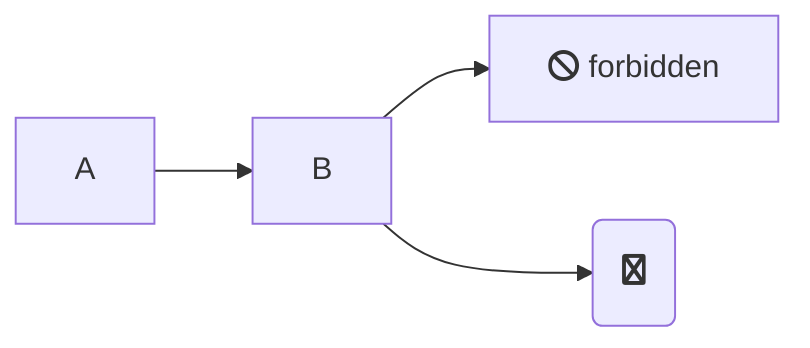
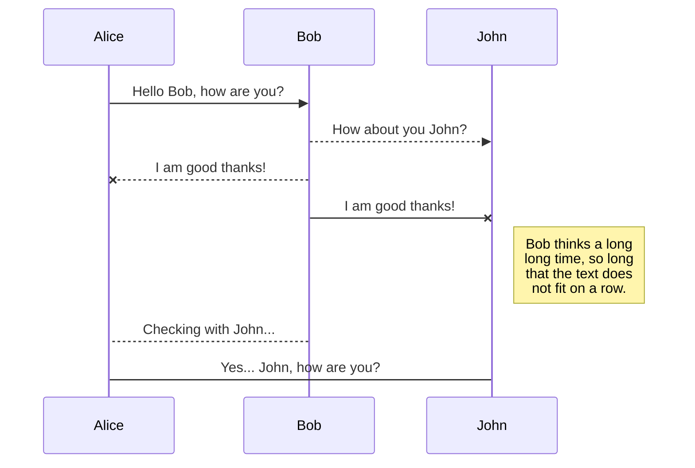

I made a [graph plugin](https://github.com/konsumer/gatsby-remark-graph) for [gatsby](https://www.gatsbyjs.org/) that uses [mermaid](https://mermaidjs.github.io/) to make quick graphs.

It works pretty good, if I don't say so myself. On my blog, I'm using the `dark` theme.